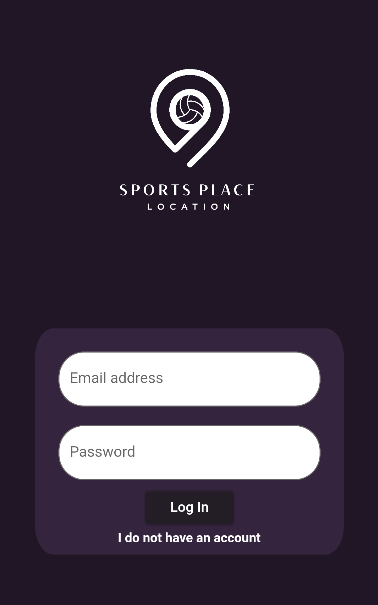
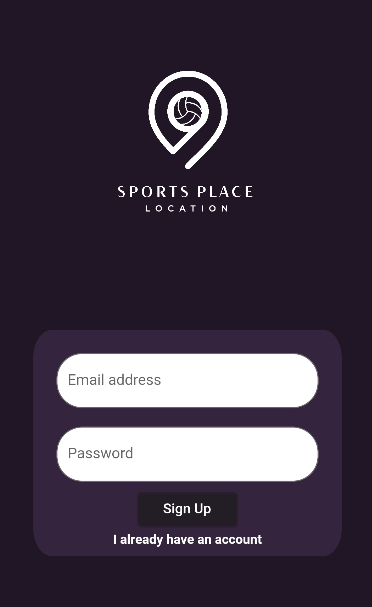
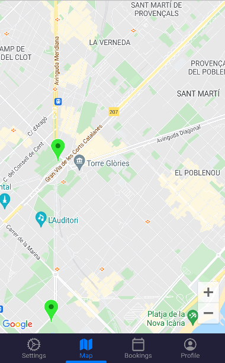
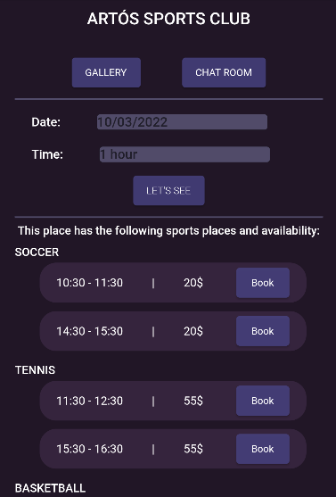
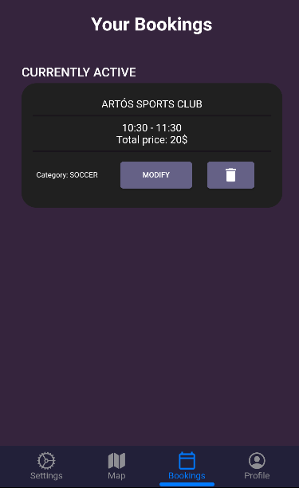

# Sports Place

Flutter Project For Sports App

## Project Idea

This project is our first entry into the flutter language and the main idea is to have an app that
let us have a list of clients that puts spaces on display for users to play sports and make reservations. 


## Getting Started

The first step to our app is to log in or create an account, for the first one we 
created a predefined user with the credentials as follows: 
````aidl
Email: temp@
Password: temp
````
The other option is to create a user clicking on the text 'I do not have an account'.
Once that, in both options once you log in or sign up it will grant the user access to the app.
Taking into account that sign up first ask of the user to edit its data.





From this moment on we have access to the map and the main menu.
We can see the markers on the map:
````aidl
Blue: Private Clubs/Spaces
Green: Public Spaces or recreative areas
````


Now we can start editing our profile in the profile section or, if we tap on a
marker we can see the data of a place and if it makes reference of a private space 
we can click on view and make our reservations using the 'Lets see' button.
Once that on the 'Bookings' section we can manage them.






